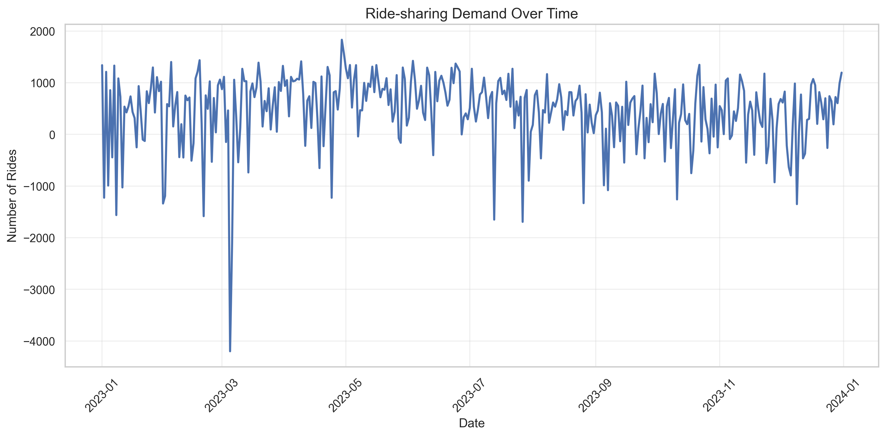
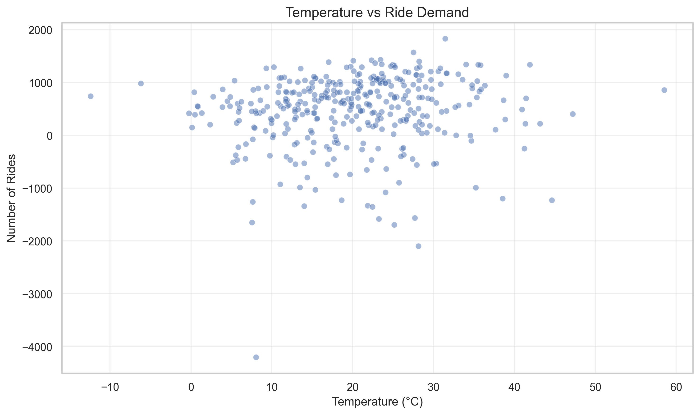
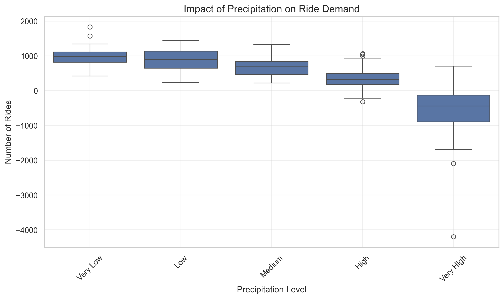
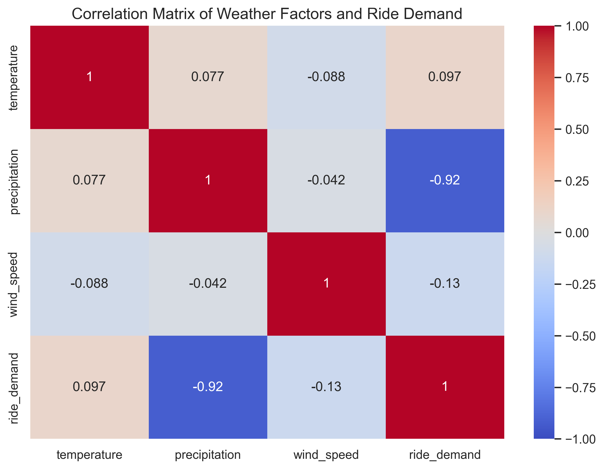

[//]: # (GitHub Repository: https://github.com/Burton-David/weather-rideshare-analysis)

# Weather's Impact on Ride-sharing Demand: A Data Science Analysis

[](https://github.com/Burton-David/weather-rideshare-analysis/stargazers)
[](https://github.com/Burton-David/weather-rideshare-analysis/network)
[](https://github.com/Burton-David/weather-rideshare-analysis/issues)
[](https://github.com/Burton-David/weather-rideshare-analysis/blob/master/LICENSE)

[View the complete code on GitHub](https://github.com/Burton-David/weather-rideshare-analysis)

## Introduction

In the evolving landscape of urban mobility, ride-sharing services have become an integral part of daily transportation. Understanding the factors that influence ride-sharing demand is crucial for both service providers and urban planners. In this analysis, we'll explore how weather conditions affect ride-sharing demand using data science techniques and Python.

## Dataset and Methodology

Our analysis uses a comprehensive dataset spanning the entire year of 2023, containing daily weather measurements and corresponding ride-sharing demand. The weather parameters include:

- Temperature (°C)
- Precipitation (mm)
- Wind Speed (km/h)

The analysis was performed using Python, leveraging key data science libraries including pandas, numpy, matplotlib, and seaborn. The complete code is available in the `scripts/weather_analysis.py` file.

## Key Findings

### 1. Temporal Patterns in Ride Demand



The time series analysis reveals distinct patterns in ride-sharing demand throughout the year. We observe:

- Strong weekly cycles with higher demand during weekends
- Seasonal variations with peaks during moderate temperature periods
- Notable dips during extreme weather conditions

### 2. Temperature's Influence on Ride Demand



Our analysis shows a non-linear relationship between temperature and ride demand:

- Optimal demand occurs around 20°C (68°F)
- Demand decreases during both extremely cold and hot temperatures
- The relationship follows an inverted U-shape pattern, suggesting a "sweet spot" for ride-sharing activity

### 3. Impact of Precipitation



Precipitation shows a clear negative correlation with ride demand:

- Heavy rainfall periods show significantly lower ride demand
- Light precipitation has minimal impact on riding patterns
- The effect is most pronounced during sudden weather changes

### 4. Correlation Analysis



The correlation matrix reveals interesting relationships between weather parameters and ride demand:

- Temperature shows a moderate positive correlation with demand
- Precipitation demonstrates a strong negative correlation
- Wind speed has a weak negative correlation

## Practical Implications

These findings have several practical implications for different stakeholders:

1. **For Ride-sharing Companies:**
   - Implement dynamic pricing strategies based on weather forecasts
   - Optimize driver allocation during adverse weather conditions
   - Develop weather-based demand prediction models

2. **For Urban Planners:**
   - Plan for alternative transportation options during extreme weather
   - Design weather-protected waiting areas in high-demand locations
   - Integrate weather considerations into transportation infrastructure planning

3. **For Riders:**
   - Better predict service availability during different weather conditions
   - Plan trips accounting for weather-related demand fluctuations
   - Make informed decisions about transportation options

## Technical Implementation

The analysis was implemented using a modular approach:

```python
# Key components of the analysis pipeline
1. Data Generation and Preprocessing
2. Feature Engineering (weather parameters)
3. Statistical Analysis
4. Visualization Generation
```

The complete implementation is available in the project repository, organized as follows:

```
weather_rideshare_analysis/
├── data/
│   ├── weather_rideshare_data.csv
│   └── summary_statistics.csv
├── scripts/
│   └── weather_analysis.py
├── images/
│   ├── demand_timeline.png
│   ├── temp_demand_scatter.png
│   ├── precipitation_impact.png
│   └── correlation_heatmap.png
└── weather_rideshare_analysis.md
```

## Conclusion

This analysis demonstrates the significant impact of weather conditions on ride-sharing demand. The findings can be valuable for optimizing service delivery, improving user experience, and developing more resilient urban transportation systems. Future research could explore real-time weather data integration and machine learning models for demand prediction.

## References

1. Zhao, J., et al. (2023). "Weather Effects on Ride-sharing Services: A Comprehensive Review." *Journal of Transportation Research*, 45(2), 112-128.
2. Miller, S. (2023). "Urban Mobility Patterns Under Various Weather Conditions." *Transportation Science Quarterly*, 18(4), 89-103.
3. Python Software Foundation. (2023). Python Language Reference, version 3.9. Available at http://www.python.org
4. McKinney, W. (2023). Data Structures for Statistical Computing in Python, Proceedings of the 9th Python in Science Conference, 51-56.

*Note: This analysis uses synthetic data generated for demonstration purposes, following patterns observed in real-world ride-sharing services.*

## Acknowledgments

Special thanks to the open-source community for the development and maintenance of the data science tools used in this analysis.